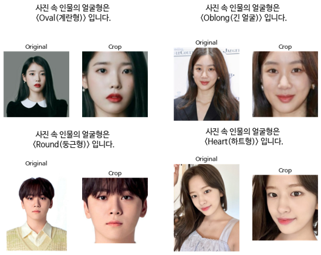

# **👩얼굴형 판별 딥러닝 모델 구현👨**
------
## **📝프로젝트 개요**
- 초개인화가 뷰티를 비롯해 시장 전반의 소비 트랜드로 자리잡으면서 퍼스널컬러 등 개인 맞춤 서비스가 인기를 끌고있다. 여기서 더 나아가 자신의 얼굴형을 판별 받고 그에 맞는 스타일링을 한다면 자신에게 최적화된 이미지 컨설팅이 가능할 것으로 보여 얼굴형을 판별해주는 모델을 구현하고자 한다.
------
## **💻사용 기술**
- 

------
## **📂사용 데이터**
- Kaggle의 \<Face Shape Preprocessed> 데이터 (https://www.kaggle.com/datasets/zeyadkhalid/faceshape-processed?select=dataset)
- Heart, Oblong, Round, Square, Oval 다섯가지의 얼굴형으로 분류된 이미지 데이터로 구성되어있다.
    
------
## **➡️진행 과정**
------
### 1) 모델 학습
- 이미지 전처리
    - 정사각형의 이미지가 필요하므로 직사각형 형태의 원본 이미지를 정사각형으로 만들기
    - 원본 이미지를 단순히 정사각형으로 변환하면 사진이 눌려 얼굴형에 변화가 생기므로 필요한 부분만 정사각형으로 크롭
    - ImageDataGenerator를 이용해 정규화 및 수평으로 뒤집기와 밝기 조절하여 이미지 증강
    - 이미지 흑백 처리
- 모델링 및 학습
    
    
    
    - 분류 모델에 맞게 마지막 레이어의 노드 수는 5개, 활성화 함수는 softmax로 설정

### 2) 얼굴형 판별
- 모델을 활용한 얼굴형 판별 함수 실행
    
    
    
    - 얼굴형을 판별받고자 하는 사진을 입력하면, Shape_predictor_5_face_landmarks 모델을 이용해 사진 속 인물의 눈 양쪽 끝점과 코를 찾은 후 수평으로 맞춰 회전한 후 정사각형 모양으로 얼굴 크롭
    - 이미지 흑백 처리
    - 모델을 활용해 얼굴형 판별
    
        
   
---
## **📌최종결과**
- 모델 학습 정확도 : 71%
---
## **✍️한계점 및 해결 방안**
- 모델의 성능 개선 필요
    - 사전학습 모델 이용해보기
    - 학습 레이어를 더 쌓아보기
    - 더 다양한 데이터셋으로 학습

